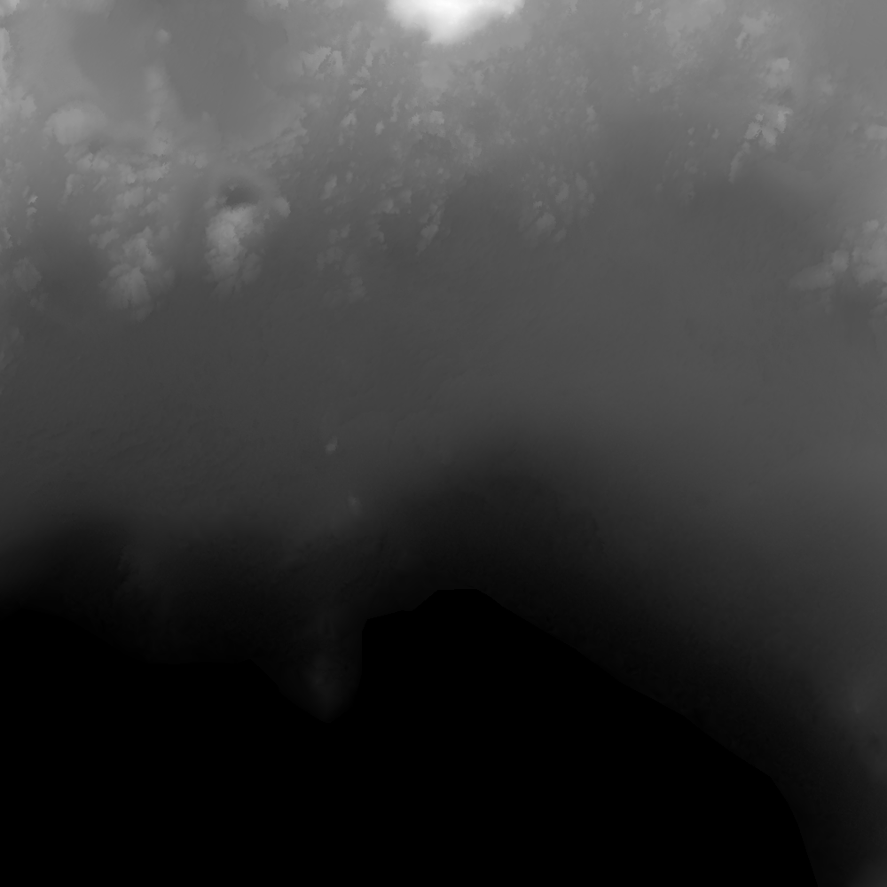
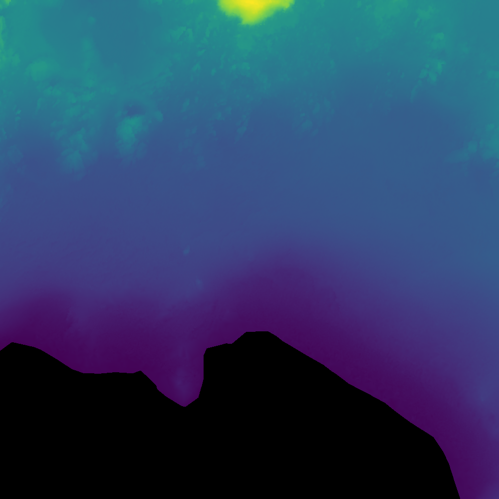
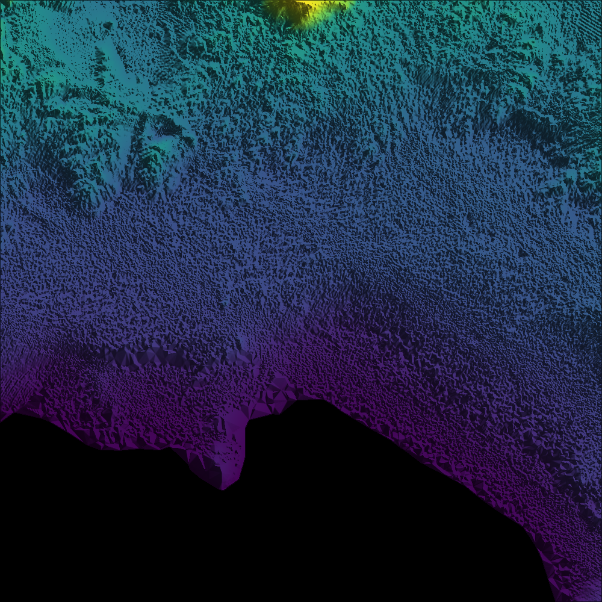

# RUST_exam

Developer's Names: 
- Muhammad Azka Bintang Pramudya 🇮🇩 
- Matthias Hans Heinrich Schmitt 🇩🇪

In the following three sections, we are going to comment on the code pipelines of the different tasks.


## Task 1a: How to Read ASC Files
For task 1, we are referring to `main_gray_scale.rs`. We implemented a function `process_asc_to_grayscale` that takes:
- A path reference to the ASC file
- A desired output path to save the grayscale image

### Steps:
1. **Initialize Hyperparameters**: Set the number of columns, rows, and define the replacement value for missing data (-99999).

```rust
let mut data: Vec<Vec<f32>> = Vec::new();
let mut ncols = 0;
let mut nrows = 0;
let mut nodata_value = -99999.0;
let mut reading_data = false;
```
2. **Read the First Lines**: Extract metadata by searching for key words.

```rust
if parts[0].to_lowercase() == "ncols" {
        ncols = parts[1].parse().unwrap_or(0);
    } 
else if parts[0].to_lowercase() == "nrows" {
        nrows = parts[1].parse().unwrap_or(0);
    } 
else if parts[0].to_lowercase() == "nodata_value" {
        nodata_value = parts[1].parse().unwrap_or(-99999.0);
    } 
else {reading_data = true;}
```
3. **Parse the Map Data**: Read the entire map and store it in a 2D vector for further processing.

```rust
let row: Vec<f32> = parts.iter().map(|&x| x.parse().unwrap_or(nodata_value)).collect();
if row.len() == ncols {
                data.push(row);
            } 
else {
                eprintln!("Warning: row length mismatch, skipping row.");
            }
```
## Task 1b: How to Retrieve a Grayscale Image from ASC Data
We implemented `save_colored_image`, which takes:
- A reference to the data vector
- The hyperparameters (min/max values)
- The output path reference

### Steps:
1. **Assess Min & Max Values**: Determine the range of the data.

```rust
let mut min_elevation = f32::MAX;
    let mut max_elevation = f32::MIN;
    for row in &data {
        for &val in row {
            if val != nodata_value {
                if val < min_elevation { min_elevation = val; }
                if val > max_elevation { max_elevation = val; }
            }
        }
    }
```
2. **Initialize the Image**: Prepare the image for pixel assignment, using the image crate.

```rust
let mut img = GrayImage::new(ncols as u32, nrows as u32);
```

3. **Normalize and Map Pixel Values**: Loop through the 2D vector, normalize each value based on min & max, and assign grayscale intensity.

```rust
for (y, row) in data.iter().enumerate() {
        for (x, &val) in row.iter().enumerate() {
            let pixel_value = if val == nodata_value {
                0 // Black for NoData
            } else {
                let scaled = ((val - min_elevation) / (max_elevation - min_elevation)) * 255.0;
                scaled.clamp(0.0, 255.0) as u8
            };
            img.put_pixel(x as u32, y as u32, Luma([pixel_value]));
        }
    }
```

### Task 2: How to Generate a Color-Scaled Image from ASC Data
For task 2, we are referring to `main_color_scale.rs`. The procedure is identical to the grayscale image generation, with one key difference:
- A **color scale** is introduced.
- The **`RgbImage` crate** is used to store the resulting image.

### Dependencies
Ensure that the following dependencies are included in your Rust project:

```toml
[dependencies]
image = "*"  # For handling images
```

### Task 3: Hillshade algorithm

Even after using color scaling, raw `.asc` elevation data can look flat and blurry. To improve the visual clarity and give it a more realistic 3D appearance, we apply **hillshading** using the **Horn method**.

---

#### 1. **Find Min/Max Elevation Values**

We use this function to find the minimum and maximum elevation values from the ASC data, while ignoring `NoData` values:

```rust
fn find_min_max(data: &Vec<Vec<f32>>, nodata: f32) -> (f32, f32) {
    let mut min = f32::MAX;
    let mut max = f32::MIN;
    for row in data {
        for &val in row {
            if val != nodata {
                if val < min { min = val; }
                if val > max { max = val; }
            }
        }
    }
    (min, max)
}
```

This is essential for **normalizing** the elevation data later.

---

#### 2. **Apply the Color Gradient (`viridis`)**

We use the [`colorgrad`](https://docs.rs/colorgrad/latest/colorgrad/) crate, specifically the `viridis` colormap, to visualize the elevation:

```rust
let grad = colorgrad::viridis();
```

Each elevation value is normalized to `[0.0, 1.0]` and mapped to a corresponding RGB color.

---

#### 3. **Prepare Image and Convert to `f64`**

The elevation data is converted to [`f64`](https://doc.rust-lang.org/std/primitive.f64.html) for numerical stability in gradient calculations:

```rust
let elev_f64: Vec<Vec<f64>> = data.iter()
    .map(|row| row.iter().map(|&x| x as f64).collect())
    .collect();
```

We also prepare a new image buffer:

```rust
let mut img = RgbImage::new(ncols as u32, nrows as u32);
```

---

#### 4. **Loop Through Pixels**

We iterate over each pixel in the elevation grid:

```rust
for y in 0..nrows {
    for x in 0..ncols {
        let val = data[y][x];
        // color + hillshade calculations go here
    }
}
```

For each point:
- If `val == nodata`, use black `[0, 0, 0]`
- Else, normalize and convert elevation to color with `viridis`
- Then calculate hillshade

---

#### 5. **Understanding the Hillshade (Horn Method)**

**Hillshading** is a cartographic technique to simulate how sunlight would illuminate terrain from a specific direction.

We use the **Horn method**, which computes slope and aspect using a 3×3 window around each cell:

##### Given a 3x3 matrix like this:

```
z1 z2 z3
z4 z5 z6
z7 z8 z9
```

With `z5` as the current pixel.

#####  Horn’s slope formulas:

- **Slope in X (east-west):**
  ```
  dz/dx = ((z3 + 2*z6 + z9) - (z1 + 2*z4 + z7)) / (8 * cell_size)
  ```

- **Slope in Y (north-south):**
  ```
  dz/dy = ((z7 + 2*z8 + z9) - (z1 + 2*z2 + z3)) / (8 * cell_size)
  ```

##### Final illumination formula:

```math
I = 255 × (sin(alt) × sin(slope) + cos(alt) × cos(slope) × cos(azimuth - aspect))
```

Where:
- `alt` = altitude angle of sun (e.g., 45°)
- `azimuth` = sun horizontal angle (e.g., 315° for NW)
- `slope` = terrain steepness
- `aspect` = slope direction

The result `I` is clamped between `0` and `255`, giving us the **grayscale hillshade**.

---

#### Final Code Snippet (Hillshade Application)

```rust
let factor = shade as f32 / 255.0;
let shaded = Rgb([
    (base_color[0] as f32 * (1.0 - factor)) as u8,
    (base_color[1] as f32 * (1.0 - factor)) as u8,
    (base_color[2] as f32 * (1.0 - factor)) as u8,
]);

img.put_pixel(x as u32, y as u32, shaded);
```

This merges the color and shade to create a realistic, pseudo-3D terrain visualization.

---

### Output

A full-color terrain image with realistic light and shadow:
```
<output_dir>/hillside.png
```


## Q3 Added feature: Automatic Batch Processing
This Rust program automatically processes all `.asc` files within a given input directory and generates corresponding visualizations (grayscale, color, and hillshade) for each file.

The program:
- Searches for all `.asc` files in the `./dataset/` folder
- Creates an output folder for each file under `./output/<filename>/`
- For each `.asc` file, generates 3 images:
  - `grayscale.png`: elevation in black & white
  - `colored.png`: elevation using the [viridis](https://docs.rs/colorgrad/latest/colorgrad/#predefined-gradients) colormap
  - `hillside.png`: shaded relief using Horn's hillshade algorithm

This loop is defined inside `main.rs`:

```rust
for entry in fs::read_dir(input_dir)? {
    let entry = entry?;
    let path = entry.path();

    if path.extension().map(|e| e == "asc").unwrap_or(false) {
        let stem = path.file_stem().unwrap().to_string_lossy();
        let output_dir: PathBuf = [output_root, &stem].iter().collect();

        fs::create_dir_all(&output_dir)?;
        // Load ASC, generate and save images
    }
}
```

---

## Input Folder Structure

Place your `.asc` files inside the `dataset` folder like this:

```
dataset/
├── ASC_file_A.asc
├── ASC_file_B.asc
└── ASC_file_C.asc
```

---

## Output Folder Structure

The output will be organized under `output/` like so:

```
output/
├── ASC_file_A/
│   ├── grayscale.png
│   ├── colored.png
│   └── hillside.png
├── ASC_file_B/
│   ├── grayscale.png
│   ├── colored.png
│   └── hillside.png
└── ASC_file_C/
    ├── grayscale.png
    ├── colored.png
    └── hillside.png
```

---

## Sample Outputs

Here are examples of images generated by the loop:

| Grayscale          | Colored            | Hillshaded         |
|--------------------|--------------------|---------------------|
|  |  |  |

> ⚠️ Make sure to generate the images first by running:
```bash
cargo run
```

---

## Notes
- You can change the input/output folders by editing:
  ```rust
  let input_dir = "./dataset";
  let output_root = "./output";
  ```
- Missing folders will be created automatically.
- Files with missing or malformed ASC data will be skipped with a warning.

---

